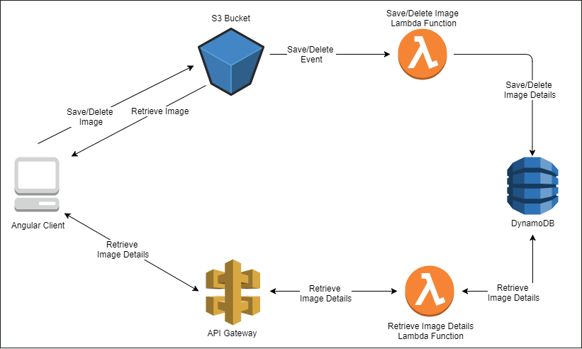

## Project Title: Deploying a Serverless Application on AWS Lambda using Terraform

## Project Overview:

The goal of this project is to deploy a serverless application on AWS Lambda using Terraform. The serverless application will read data from an S3 bucket, process it using a custom script, and store the processed data in a DynamoDB table. The serverless application will be exposed as a RESTful API using API Gateway.

## Prerequisites:

Before starting this project, you will need the following:

- An AWS account with sufficient permissions to create the infrastructure resources needed for the serverless application.
- Terraform installed on your local machine.
- Basic knowledge of AWS services like S3, DynamoDB, IAM, Lambda, and API Gateway.
- Basic knowledge of Python programming language.

## Architecture:

The architecture of the serverless application is as follows:



- The S3 bucket holds the data for the serverless application.
- The Lambda function reads the data from the S3 bucket and processes it using a custom script.
- The processed data is stored in the DynamoDB table.
- The Lambda function is exposed as a RESTful API using API Gateway.

## Terraform Configuration:

The Terraform configuration file [`main.tf`](./main.tf) defines the infrastructure resources needed for the serverless application:

```terraform
# Define the provider
provider "aws" {
  region = "us-east-1"
}

# Define the S3 bucket
resource "aws_s3_bucket" "data_bucket" {
  bucket = "my-data-bucket"
}

# Define the DynamoDB table
resource "aws_dynamodb_table" "processed_data" {
  name         = "processed-data"
  hash_key     = "id"
  read_capacity = 5
  write_capacity = 5

  attribute {
    name = "id"
    type = "S"
  }

  attribute {
    name = "data"
    type = "S"
  }
}

# Define the IAM role for the Lambda function
resource "aws_iam_role" "lambda_role" {
  name = "lambda-role"

  assume_role_policy = jsonencode({
    Version = "2012-10-17"
    Statement = [
      {
        Action = "sts:AssumeRole"
        Effect = "Allow"
        Principal = {
          Service = "lambda.amazonaws.com"
        }
      }
    ]
  })
}

# Define the IAM policy for the Lambda function
resource "aws_iam_policy" "lambda_policy" {
  name        = "lambda-policy"
  policy      = jsonencode({
    Version = "2012-10-17"
    Statement = [
      {
        Action = [
          "s3:GetObject",
          "dynamodb:PutItem"
        ]
        Effect   = "Allow"
        Resource = [
          "${aws_s3_bucket.data_bucket.arn}/*",
          "${aws_dynamodb_table.processed_data.arn}"
        ]
      }
    ]
  })
}

# Attach the IAM policy to the IAM role
resource "aws_iam_role_policy_attachment" "lambda_attachment" {
  policy_arn = aws_iam_policy.lambda_policy.arn
  role       = aws_iam_role.lambda_role.name
}

# Define the Lambda function
resource "aws_lambda_function" "process_data" {
  function_name = "process-data"
  role          = aws_iam_role.lambda_role.arn
  handler       = "process_data.lambda_handler"
  runtime       = "python3.8"
  timeout       = 30
  memory_size   = 128

  # Package the Lambda function and dependencies into a zip file
  filename      = "process_data.zip"
  source_code_hash = filebase64sha256("process_data.zip")
}

# Define the API Gateway
resource "aws_api_gateway_rest_api" "serverless_api" {
  name        = "serverless-api"
  description = "RESTful API for the serverless application"
}

# Define the API Gateway resource
resource "aws_api_gateway_resource" "serverless_resource" {
  rest_api_id = aws_api_gateway_rest_api.serverless_api.id
  parent_id   = aws_api_gateway_rest_api.serverless_api.root_resource_id
  path_part   = "process-data"
}

# Define the API Gateway method
resource "aws_api_gateway_method" "serverless_method" {
  rest_api_id   = aws_api_gateway_rest_api.serverless_api.id
  resource_id   = aws_api_gateway_resource.serverless_resource.id
  http_method   = "POST"
  authorization = "NONE"
}

# Define the API Gateway integration for the Lambda function
resource "aws_api_gateway_integration" "serverless_integration" {
  rest_api_id = aws_api_gateway_rest_api.serverless_api.id
  resource_id = aws_api_gateway_resource.serverless_resource.id
  http_method = aws_api_gateway_method.serverless_method.http_method
  type        = "AWS_PROXY"
  uri         = aws_lambda_function.process_data.invoke_arn
}

# Define the API Gateway deployment
resource "aws_api_gateway_deployment" "serverless_deployment" {
  rest_api_id = aws_api_gateway_rest_api.serverless_api.id
  stage_name  = "prod"
}

# Output the API Gateway endpoint URL
output "api_gateway_url" {
  value = aws_api_gateway_deployment.serverless_deployment.invoke_url
}
```

The configuration file defines the following resources:

- Provider: The AWS provider is defined, with the region set to `us-east-1`.
- S3 Bucket: An S3 bucket is defined, with the name `my-data-bucket`.
- DynamoDB Table: A DynamoDB table is defined, with the name `processed-data`, and a hash key of `id`.
- IAM Role: An IAM role is defined for the Lambda function, with the name `lambda-role`.
- IAM Policy: An IAM policy is defined for the Lambda function, with permissions to read from the S3 bucket and write to the DynamoDB table.
- Lambda Function: A Lambda function is defined, with the name `process-data`, and configured to read data from the S3 bucket, process it using a custom script, and write the processed data to the DynamoDB table.
- API Gateway: An API Gateway is defined, with the name `serverless-api`, and configured to expose the Lambda function as a RESTful API.
- API Gateway Resource: An API Gateway resource is defined, with the path part `process-data`.
- API Gateway Method: An API Gateway method is defined, with the HTTP method set to `POST`, and no authorization required.
- API Gateway Integration: An API Gateway integration is defined, to integrate the Lambda function with the API Gateway.
- API Gateway Deployment: An API Gateway deployment is defined, to deploy the API Gateway to the `prod` stage.
- Output: An output is defined to display the API Gateway endpoint URL.

## Deploying the Serverless Application:

To deploy the serverless application, follow these steps:

1. Create a directory for the Terraform configuration file, and navigate to the directory:
```
mkdir serverless-app
cd serverless-app
```

2. Create a file named `main.tf`, and copy the Terraform configuration file contents shown above into the file.

3. Create a Python script named [`process_data.py`](./process_data.py), and copy the following code into the script:

```python
import boto3
import json

s3 = boto3.client('s3')
dynamodb = boto3.client('dynamodb')

def lambda_handler(event, context):
    # Get the S3 bucket and key from the event
    bucket_name = event['Records'][0]['s3']['bucket']['name']
    object_key = event['Records'][0]['s3']['object']['key']

    # Read the data from the S3 object
    response = s3.get_object(Bucket=bucket_name, Key=object_key)
    data = response['Body'].read().decode('utf-8')

    # Process the data
    processed_data = data.upper()

    # Write the processed data to the DynamoDB table
    item = {
        'id': {'S': object_key},
        'data': {'S': processed_data}
    }
    dynamodb.put_item(TableName='processed-data', Item=item)

    # Return a success message
    return {
        'statusCode': 200,
        'body': json.dumps('Data processed successfully!')
    }
```

4. Zip the `process_data.py` script and its dependencies into a zip file named `process_data.zip`:
```
zip -r process_data.zip process_data.py
```

5. Initialize the Terraform configuration:
```
terraform init
```

6. Plan the Terraform deployment:
```
terraform plan
```

7. Apply the Terraform deployment:
```
terraform apply
```

8. After the deployment is complete, the API Gateway endpoint URL will be displayed as an output. Use this URL to access the serverless application.

## Conclusion:

In this project, we learned how to deploy a serverless application on AWS Lambda using Terraform. We defined infrastructure resources like S3, DynamoDB, IAM, Lambda, and API Gateway using Terraform configuration files. We also created a custom Python script to process the data and store it in a DynamoDB table. Finally, we deployed the serverless application using Terraform, and exposed it as a RESTful API using API Gateway.